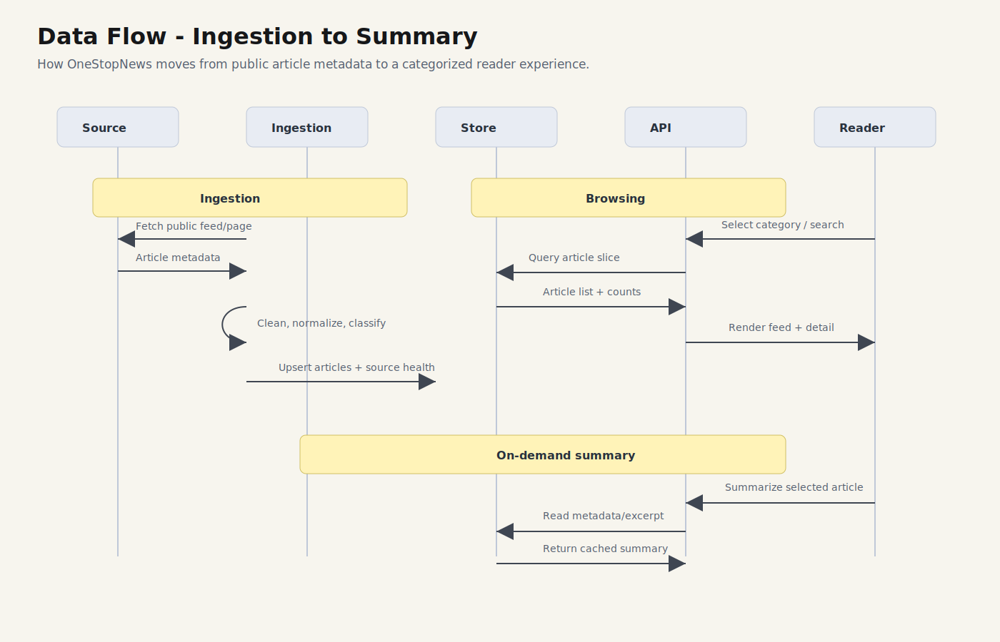

# OneStopNews Technical Architecture

**Classification:** Public-safe architecture overview  
**Purpose:** Explain the product's system shape without exposing private implementation details.

---

## High-Level Architecture

OneStopNews follows a simple modular web architecture:

- **Public Web App** for browsing topics, reading cards, and opening article details.
- **Backend Service** for article APIs, source ingestion, topic classification, and summary requests.
- **External Sources** for public article metadata and original publisher links.
- **Data Store** for cached article metadata, source health, source-provided media/popularity metadata, and generated summaries.

---

## Data Flow

The product flow has three major paths:

1. **Ingestion** - source metadata is fetched, cleaned, deduplicated, categorized, and stored.
2. **Browsing** - the reader selects a topic, searches, sorts, and views article cards.
3. **Summarization** - summaries are generated only when the reader asks for one.

---

## Public System Boundaries

| Area | Public Description |
|---|---|
| Sources | Public RSS feeds, public article pages, and publisher links |
| Ingestion | Collects article metadata and source health signals |
| Categorization | Groups articles into top-level categories and subcategories |
| Feed Ordering | Presents balanced topic feeds using public-safe article metadata |
| Summaries | Generated on demand and shown as a reading aid |
| Original Links | Readers are sent to the publisher for the full article |

---

## Private Implementation Boundaries

The following details are intentionally excluded from the public repo:

- source-specific ingestion workarounds
- ranking logic
- classification rules
- summarization internals
- deployment configuration
- environment variables
- private data files
- backend source code

This keeps the public repo useful for product review while protecting the core implementation.

---

## Current MVP Shape

| Layer | Public Description |
|---|---|
| Frontend | Responsive news-reading interface |
| Backend | API service for article feed, source status, ingestion, and summaries |
| Persistence | Stores article metadata, source health, and cached summaries |
| Sources | Public sources grouped into OneStopNews categories |
| Summaries | On-demand, cost-conscious summaries |

---

## Content Safety Model

OneStopNews does not reproduce full publisher articles.

The system is designed to show:

- article metadata
- source attribution
- summaries
- direct original links

The original publisher remains the source of record.
